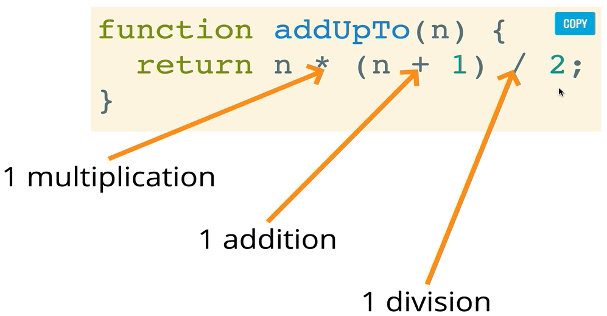

# Big O

어떤 문제의 해결 방식이 두개가 있다고 할 때, 어떤것이 방식이 최선인건지

## 더 나은 코드란?

- 처리가 빠른 것?
- 얼마나 메모리를 사용하는지?
- 가독성이 쉬운?

## 시간을 통해 비교

- 기기마다 시간 기록은 차이가 난다
- 똑같은 기계가 다른 시간 기록을 낼 수 있다
- 빠른 알고리즘에선는 정말 빠르게 알고리즘이 처리됨

> 만약 시간을 사용하지 않으면 어떤것을 사용하여 비교할까?

코드가 실행될 때 걸리는 정확한 시간을 초로 측정하는것보다는 대신에 컴퓨터가 처리해야하는 연산 갯수를 세면 된다
<br>
<br>

</img>
<br>
<br>

## Big O

정식으로 입력된 내용이 늘어날 수록 알고리즘에 실행시간이 어떻게 변하는지 설명하는 공식적인 방식
<br><br>
어떠한 function의 입력 값이 늘어나는 것과 function 실행 시간이 변하는 관계  
입력의 크기와 실행시간의 관계
<br><br>

> 즉, n의 값이 커질 수록 실행 시간에 대한 가장 높은 비례

```javascript
// 1
function addUpTo(n) {
  let total = 0;
  for (let i = 1; i <= n; i++) {
    total += i;
  }
  return total;
}
```

```javascript
// 2
function addUpTo(n) {
  return (n * (n + 1)) / 2;
}
```

```javascript
// 3
function countUpAndDown(n) {
  console.log("Going Up!");
  for (let i = 0; i < n; i++) {
    console.log(i);
  }
  console.log("At the top! \n Going down...");
  for (let j = n - 1; j >= 0; j--) {
    console.log(j);
  }
  console.log("Back down. Bye!");
}
```

```javascript
// 4
function logAtLeast5(n) {
  for (var i = 1; i < Math.max(5, n); i++) {
    console.log(i);
  }
}
```

```javascript
// 5
function logAtMostt5(n) {
  for (var i = 1; i < Math.min(5, n); i++) {
    console.log(i);
  }
}
```

1. n의 값이 늘어나도 어떠한 시간 변화가 x => **O(1)**
2. n의 값이 늘어날수록 시간도 정비례로 늘어남 => **O(n)**
3. 첫번째, 두번째 for문 **O(n)** => **O(n)**
4. n 5보다 클 경우 **O(n)** => **O(n)**
5. n이 커져도 아무 영향 주지 x 5까지만 출력 => **O(1)**

## 공간복잡도

메모리적으로 접근

> 알고리즘 자체가 필요로 하는 공간

- 원시 타입 데이터(undefined, booleans, numbers, null) 고정된 크기 => **O(1)**
- 문자열 => **O(n)**
- 참조/주소 타입(array, object) : => 일반적으로 **O(n)**
