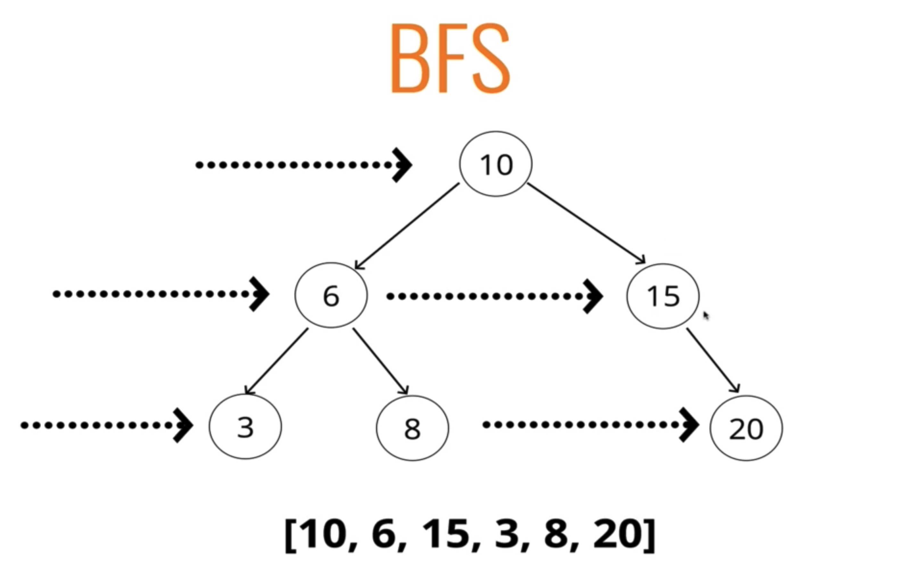

# BFS (너비우선탐색)

</img>

## 트리를 가로질러서 탐색하는 방법

---

- queue(선입선출)를 이용해야 한다. 직접 클래스를 만드는 것이 아닌 배열로 하는것 추천. shift나 push 메서드 사용
- 루프에 큐를 넣고 큐에 무언가가 있다면 계속 루프를 돌린다.
  - 배열을 사용한다면 큐에서 dequeue (맨 앞을 제거) 후 리스트에 추가
  - 노드에 왼쪽 값이 있는지 확인해서 있다면 큐에 넣어줌
  - 노드 오른쪽에 값이 있다면 큐에 넣어줌
- 루프가 끝난 후 모든 값을 저장한 변수를 출력해 준다.

---

예시

                10
            6       15
          3   8        20

queue : [];
visited : [];

- 첫번째 깊이의 값이 좌우에 있다

  - queue : [10];
  - visited : [];
     
     

- 10을 shift();
  - queue : [];
  - visited : [10];
     
     
- 10이 자식이 있다
  - queue : [6, 15];
  - visited : [10];
     
     
- 선입선출
  - queue : [15];
  - visited : [10, 6];
     
     
- 6이 자식을 가지고 있다
  - queue : [15, 3, 8];
  - visited : [10, 6];
     
     
- 너비 우선 탐색임으로 같은 너비 레벨에 대한 작업이 먼저 끝날때까지 기다림
  - queue : [3, 8];
  - visited : [10, 6, 15];
     
     
- 같은 너비 레벨들이 위에것 반복
  - queue : [3, 8, 20];
  - visited : [10, 6, 15];
     
     
  - queue : [8, 20];
  - visited : [10, 6, 15, 3];
     
     
  - queue : [20];
  - visited : [10, 6, 15, 3, 8];
     
     
  - queue : [];
  - visited : [10, 6, 15, 3, 8, 20];
